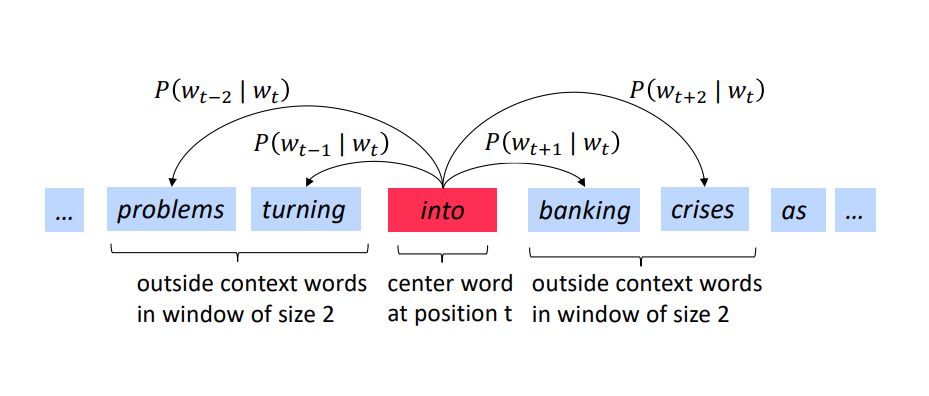

# DAY ONE -  Introduction and Word Vectors

:warning: Slides for the first lecture can be found [here](slides/#).

## Introduction 

**What is Natural Language Processing (NLP)?**

Natural Language Processing is a field at the intersection of 

1. computer science
1. artificial intelligence
1. and linguistics. 

The **goal** is to process natural language in order to perform tasks that are useful. 

### NLP Levels 

The whole NLP process can be divided into variuos levels which is shown below - 


### What's special about human language?

A human language is a system specifically constructed to convey the speaker/writer's meaning. 

Unlike, other forms of data, human language is very well constructed and usually contains some meaning. 

:warning: A human language is a **descrete/symbolic/categorical** signalling system.  

:boom: Humans communicate using sound, gesture and images.

### What's Deep Learning?

Machine learning in general can be summed up to somewhat like this in general - 

```ML in practice = Describing your data with features a computer can understand + Learning Algorithm```

```Deep Learning``` algorithms attempt to learn (multiple levels of) representation and an output.

```Representation learning``` attempts to automatically learn good features or representations from raw inputs like sound, characters or words.

Deep Learning does not necessarily always have to use Neural Networks, it can also use other probabilistic models.

### Reasons for exploring Deep Learning

Below mentioned are some reasons why Deep Learning needs to be explored - 

1. Manually designed features are often over-specified, incomplete and take a long time to design and validate.

1. **Learned Features** are easy to adapt, fast to learn. 

1. Deep Learning can learn ```unsupervised```(from raw text) and ```supervised```(with specific labels like positive/negative)

1. Improved performance (Speech recognition and Computer Vision). 

There are many other reasons as well.

### Deep NLP 

Combine ideas and goals of NLP with representation learning and deep learning methods to solve them.

**```Morpheme```** - a meaningful morphological unit of a language that cannot be further divided.

```Deep Learning method -```

1. Every word, every phrase and every logical expression is a vector.

1. A neural network combines two vectors into one vector.

:warning: More on this later.

### Dialog Agents / Response Generation 

An application of the powerful, general technique of ```Natural Language Model```, which is an instance of ```Recurrent Neural Network```.

Google's Inbox replies uses ```RNN``` to read the mail, it then suggests replies depending on the context of the mail.

### Neural Machine Translation 

Source sentence is mapped to a vector, then output senetence is generated.

### Important Resources

1. https://nlp.stanford.edu/pubs/snli_paper.pdf
1. https://nlp.stanford.edu/~lmthang/data/papers/conll13_morpho.pdf
1. https://arxiv.org/abs/1604.00788
1. https://arxiv.org/abs/1409.0473
1. https://arxiv.org/abs/1409.3215

## How do we represent the meaning of a word?

Word Vectors are primarily used to represent the meaning of a word.

## How do we have usable meaning in a computer? 

A common taxonomy like ```WordNet``` that has hypernymes (is-a) relationships and sysnonym sets.

### Hypernym vs Hyponym

> In simpler terms, a hyponym is in a type-of relationship with its hypernym. For example, pigeon, crow, eagle and seagull are all hyponyms of bird (their hypernym); which, in turn, is a hyponym of animal.

[!hypernym-vs-hyponym](#image)

## Problems with descrete representation 

There are a few problems with ```WordNet``` which are mentioned below - 

1.  Great as a resource but missing nuances.

    For instance, synonymes for good can be adept, expert, good, practiced, proficient, skillful etc, but all of these words denote a varying level of meaning. 

    For instance, when someone says that they are *good at something* and when they say they are *expert at something*; both of these sentences have a subtle difference albeit the words good and expert are synonymes.

1.  Missig new words. 

    WordNet is not able to keep track of all the new words being introduced to a language. 

1.  Requires human labour to create and adapt. 

### One-Hot representation

It is a ```localist``` represenatation. It consists of a vector space of ```zeros``` and ```ones```. The vector space is marked with ```one```, if the word matches a word present in word vector.  

One-Hot encoding is used to perform ```binarization```. It converts a ```feature set``` to a ```binary feature set```.

:boom: It is a symbolic representation. 

#### Why are One-Hot representations bad?

```One-Hot```representation cannot be used to find the similarity between words. It doesn't give us the measure as to how similar a word is to another word. 

:warning: There is no natural notion of similarity in a set of one-hot vectors.

:exclamation: Let us consider an example where we have two sentences which contains the word ```hotel``` and ```motel```. If we represent the one-hot encoding of the two words by ```x``` and ```y```, and then evaulate ```x transpose . y``` the result will turn out to be zero.

## Distributional similarity based representations

Here, a word is given a weight depending upon the neighbouring words (also known as context words).

> Effectively, Word2Vec/Doc2Vec is based on distributional hypothesis where the context for each word is its nearby words. Similarly, LSA takes the entire document as the context. Both techniques solve the word embedding problem - embed words into a continuous vector space while keeping semantically related words close together.

> On the other hand, LDA isn't made to solve the same problem. They deal with a different problem called topic modelling, which is finding latent topics in a set of documents.

:warning: Please read this StackOverflow post on the difference between ```distributed representation``` and ```distributional representation```. 

### Word Vectors

> “You shall know a word by the company it keeps” (J. R. Firth 1957: 11)

:warning: ```word vectors``` are sometimes called ```word embeddings``` or ```word representations```. They are distributed representation.

Word vectors have the following - 

1. ```Context words``` 
   
   Context words are a set of words that appear next to a given word. 

2. ```Center words```
   
   Center words are the words from which the context words are formed. Context words appear next to center words.

## Word2vec: Overview

> It is a framework for learning word vectors. 

<p align="center"></p>

The alogorithm for Word2vec is as follows - 

1. We have a large corpus of text
2. Every word in a fixed vocabulary is represented by a vector
3. Go through each position ```t``` in the text, which has a center word and context (“outside”) words o
4. Use the similarity of the word vectors for c and o to calculate the probability of o given c (or vice versa)
5. Keep adjusting the word vectors to maximize this probability

## Word2vec Objective Function

